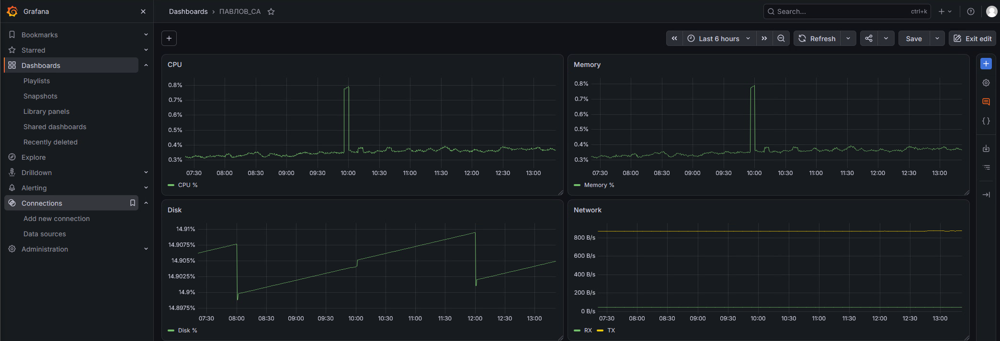

# Отчёт по домашнему заданию по практике с Prometheus (23.09)

- **Автор:** Павлов Сергей
- **Дата выполнения:** 29.09.2026
- **Задание:** 
  - Настроить дашборд  4-мя графиками:
    - Память;
    - Процессор;
    - Диск;
    - Сеть.
  - Настройить на одной из систем:
    - Zabbix (использовать Screen);
    - Prometheus + Grafana.

---

## Исходное состояние

- VMWare ESXI
- Хостовая ОС: Ubuntu 24.04.1 LTS

---

## Ход работы
Для выполнения задания выбран стек `Prometheus + Grafana`, развёрнутый через Docker Compose. Такой подход позволяет быстро поднять весь стек одной командой, легко масштабируется и не требует ручной установки зависимостей.

### 1. Настройка ВМ
Установка Docker и Docker Compose:
```
zenhert@linpro:~$ sudo apt update
zenhert@linpro:~$ sudo apt install -y ca-certificates curl gnupg lsb-release
zenhert@linpro:~$ sudo mkdir -p /etc/apt/keyrings
zenhert@linpro:~$ curl -fsSL https://download.docker.com/linux/ubuntu/gpg | sudo gpg --dearmor -o /etc/apt/keyrings/docker.gpg
zenhert@linpro:~$ echo "deb [arch=$(dpkg --print-architecture) signed-by=/etc/apt/keyrings/docker.gpg] https://download.docker.com/linux/ubuntu $(lsb_release -cs) stable" | sudo tee /etc/apt/sources.list.d/docker.list > /dev/null
zenhert@linpro:~$ sudo apt update
zenhert@linpro:~$ sudo apt install -y docker-ce docker-ce-cli containerd.io docker-compose-plugin
zenhert@linpro:~$ sudo usermod -aG docker $USER
zenhert@linpro:~$ newgrp docker
```

Проверка:
```
zenhert@linpro:~$ docker --version
Docker version 29.8.1, build 4a63305
zenhert@linpro:~$ docker compose version
Docker Compose version v5.5.1
```

### 2. Настройка мониторинга
Создание директории и файлов:
```
zenhert@linpro:~$ mkdir ~/monitoring && cd ~/monitoring
zenhert@linpro:~$ touch docker-compose.yml
zenhert@linpro:~$ touch prometheus.yml
```

Файл `docker-compose.yml`:
```
services:
  node_exporter:
    image: prom/node-exporter:latest
    container_name: node_exporter
    restart: unless-stopped
    ports:
      - "9100:9100"
    volumes:
      - /proc:/host/proc:ro
      - /sys:/host/sys:ro
      - /:/rootfs:ro
    command:
      - '--path.procfs=/host/proc'
      - '--path.sysfs=/host/sys'
      - '--path.rootfs=/rootfs'
      - '--collector.filesystem.mount-points-exclude=^/(sys|proc|dev|host|etc)($$|/)'

  prometheus:
    image: prom/prometheus:latest
    container_name: prometheus
    restart: unless-stopped
    ports:
      - "9090:9090"
    volumes:
      - ./prometheus.yml:/etc/prometheus/prometheus.yml
      - prometheus_data:/prometheus
    command:
      - '--config.file=/etc/prometheus/prometheus.yml'
      - '--storage.tsdb.path=/prometheus'
    depends_on:
      - node_exporter

  grafana:
    image: grafana/grafana:latest
    container_name: grafana
    restart: unless-stopped
    ports:
      - "3000:3000"
    volumes:
      - grafana_data:/var/lib/grafana
    environment:
      - GF_SECURITY_ADMIN_USER=admin
      - GF_SECURITY_ADMIN_PASSWORD=admin
    depends_on:
      - prometheus

volumes:
  prometheus_data:
  grafana_data:
```

Файл конфигурации `prometheus.yml`:
```
global:
  scrape_interval: 15s
  evaluation_interval: 15s

scrape_configs:
  - job_name: 'prometheus'
    static_configs:
      - targets: ['localhost:9090']

  - job_name: 'node_exporter'
    static_configs:
      - targets: ['node_exporter:9100']
```

Запуск стека:
```
zenhert@linpro:~/monitoring$ docker compose up -d
[+] Running 4/4
 ✔ Network monitoring_default       Created
 ✔ Container node_exporter          Started
 ✔ Container prometheus             Started
 ✔ Container grafana                Started
zenhert@linpro:~/monitoring$ docker compose ps
NAME            IMAGE                       STATUS         PORTS
grafana         grafana/grafana:latest      Up 30 seconds  0.0.0.0:3000->3000/tcp
node_exporter   prom/node-exporter:latest   Up 30 seconds  0.0.0.0:9100->9100/tcp
prometheus      prom/prometheus:latest      Up 30 seconds  0.0.0.0:9090->9090/tcp
```

### 3. Создание дашборда
Настройка источника данных в Grafana:
В веб-интерфейсе Grafana логин/пароль по умолчанию — `admin/admin`.
  - Открыть `Connections → Data sources → Add data source → Prometheus`.
  - В поле Connection URL указать `http://prometheus:9090` (имя контейнера внутри Docker-сети).
  - Нажать `Save & test` — `Successfully queried the Prometheus API`.

Дашборд назван `ПАВЛОВ_СА`, для каждой панели использован источник данных `Prometheus`:
  - Панель 1. CPU:
```
100 - (avg by(instance) (rate(node_cpu_seconds_total{mode="idle"}[5m])) * 100)
```
Единица измерения: `percent (0-100)`
  - Панель 2. Memory:
```
(1 - (node_memory_MemAvailable_bytes / node_memory_MemTotal_bytes)) * 100
```
Единица измерения: `percent (0-100)`
  - Панель 3. Disk:
```
100 - ((node_filesystem_avail_bytes{mountpoint="/"} * 100) / node_filesystem_size_bytes{mountpoint="/"})
```
Единица измерения: `percent (0-100)`
  - Панель 4. Network:
```
rate(node_network_receive_bytes_total{device!="lo"}[5m])
```
```
rate(node_network_transmit_bytes_total{device!="lo"}[5m])
```
Единица измерения: `bytes/sec (SI)`

Результат:



