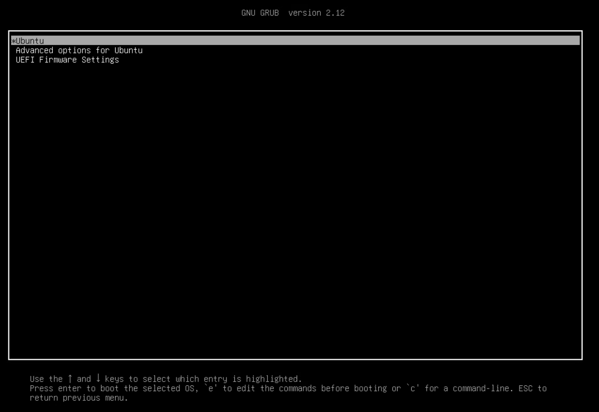

# Отчёт по домашнему заданию по работе с загрузчиком (27.07)

- **Автор:** Павлов Сергей
- **Дата выполнения:** 10.08.2026
- **Задание:** 
  - Включить отображение меню Grub;
  - Попасть в систему без пароля несколькими способами;
  - Установить систему с LVM, после чего переименовать VG.

---

## Исходное состояние

- VMWare ESXI
- Хостовая ОС: Ubuntu 24.04.1 LTS

---

## Ход работы

### 1. Включить отображение меню Grub
На загруженной системе открыть `/etc/default/grub`:
```
zenhert@linpro:~$ sudo nano /etc/default/grub
```

Нужно найти строки:
```
GRUB_TIMEOUT_STYLE=hidden
GRUB_TIMEOUT=0
```

Привести к виду:
```
#GRUB_TIMEOUT_STYLE=hidden
GRUB_TIMEOUT=10
```

Далее сохранить файл, обновить GRUB и перезагрузиться:
```
zenhert@linpro:~$ sudo update-grub
Sourcing file `/etc/default/grub'
Generating grub configuration file ...
Found linux image: /boot/vmlinuz-6.8.0-137-generic
Found initrd image: /boot/initrd.img-6.8.0-137-generic
Warning: os-prober will not be executed to detect other bootable partitions.
Systems on them will not be added to the GRUB boot configuration.
Check GRUB_DISABLE_OS_PROBER documentation entry.
Adding boot menu entry for UEFI Firmware Settings ...
done
zenhert@linpro:~$ sudo reboot
```

При загрузке теперь видно меню GRUB:


### 2. Попасть в систему без пароля несколькими способами
Способ 1:
  - При появлении меню GRUB выбрать пункт `Ubuntu` и нажать `e` (edit);
  - Найти строку, начинающуюся с `linux` (там есть vmlinuz-...);
  - В конце найденной строки добавить `init=/bin/bash`;
  - Нажать `Ctrl+X` для загрузки;
  - Система загрузится в root-шелл без пароля. Файловая система будет смонтирована только для чтения. Нужно будет выполнить:
  ```
  mount -o remount,rw /
  ```
  Теперь можно делать что угодно.

Способ 2:
  - В меню GRUB выбрать пункт `Advanced options for Ubuntu`;
  - Выбрать ядро с пометкой `(recovery mode)`;
  - Появится меню восстановления. Далее выбрать пункт `network`, это перемонитрует корень в read-write и включит сеть;
  - Выбрать пункт `root`, откроется консоль с правами root. По-умолчанию пароля нет, поэтому если запросит пароль, то просто нажать `Enter`;
  - Теперь доступна root-консоль с полным доступом.

### 3. Установить систему с LVM, после чего переименовать VG
Для начала необходимо установить систему в включенной опцией `Use LVM with the new Ubuntu installation`, после установки загрузиться в систему. 

Проверка текущей VG:
```
zenhert@linpro:~$ sudo vgs
  VG        #PV #LV #SN Attr   VSize    VFree
  ubuntu-vg   1   1   0 wz--n- <196.95g 98.47g
```

Переименование VG:
```
zenhert@linpro:~$ sudo vgrename ubuntu-vg ubuntu-zen
  Volume group "ubuntu-vg" successfully renamed to "ubuntu-zen"
```

После переименования нужно поправить все места, где используется старое имя.

Правка `fstab`:
```
zenhert@linpro:~$ sudo sed -i 's/ubuntu--vg/ubuntu--zen/g' /etc/fstab
```

Обновление `/boot/grub/grub.cfg`:
```
zenhert@linpro:~$ sudo sed -i 's/ubuntu--vg/ubuntu--zen/g' /boot/grub/grub.cfg
```

Обновление `initramfs`:
```
zenhert@linpro:~$ sudo update-initramfs -u
update-initramfs: Generating /boot/initrd.img-6.8.0-137-generic
```

Перезагрузка и финальная проверка:
```
zenhert@linpro:~$ sudo reboot
zenhert@linpro:~$ sudo vgs
[sudo] password for zenhert:
  VG         #PV #LV #SN Attr   VSize    VFree
  ubuntu-zen   1   1   0 wz--n- <196.95g 98.47g
```

Готово, система работает с новым именем VG. При желании можно переименовать и LV аналогичным способом.