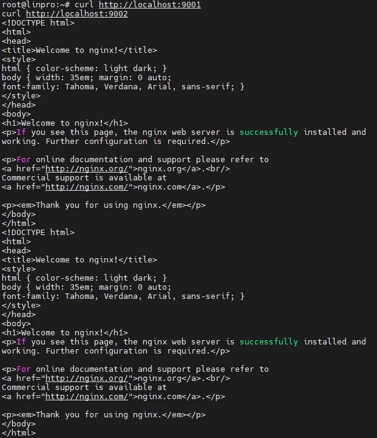

# Отчёт по домашнему заданию по работе с Systemd (30.07)

- **Автор:** Павлов Сергей
- **Дата выполнения:** 10.08.2026
- **Задание:** 
  - Написать service, который будет раз в 30 секунд мониторить лог на предмет наличия ключевого слова (файл лога и ключевое слово должны задаваться в /etc/default);
  - Установить spawn-fcgi и создать unit-файл (spawn-fcgi.sevice) с помощью переделки init-скрипта (https://gist.github.com/cea2k/1318020);
  - Доработать unit-файл Nginx (nginx.service) для запуска нескольких инстансов сервера с разными конфигурационными файлами одновременно.

---

## Исходное состояние

- VMWare ESXI
- Хостовая ОС: Ubuntu 24.04.1 LTS

---

## Ход работы

### 1. Написать service, который будет раз в 30 секунд мониторить лог на предмет наличия ключевого слова
Создание конфигурационного файла для переменных:
```
root@linpro:~# cat > /etc/default/watchlog << EOF
# Configuration file for my watchlog service
# Place it to /etc/default

# File and word in that file that we will be monit
WORD="ALERT"
LOG=/var/log/watchlog.log
EOF
```

Создание лог-файла с ключевым словом:
```
root@linpro:~# cat > /var/log/watchlog.log << EOF
Everything is fine
No alerts here
ALERT: Something happened
ALERT: Critical error
Normal message
EOF
root@
```

Создание скрипта мониторинга:
```
root@linpro:~# cat > /opt/watchlog.sh << 'EOF'
#!/bin/bash
WORD=$1
LOG=$2
DATE=`date`

if grep $WORD $LOG &> /dev/null
then
    logger "$DATE: I found word, Master!"
else
    exit 0
fi
EOF

chmod +x /opt/watchlog.sh
```

Создание unit-сервиса:
```
root@linpro:~# cat > /etc/systemd/system/watchlog.service << EOF
[Unit]
Description=My watchlog service

[Service]
Type=oneshot
EnvironmentFile=/etc/default/watchlog
ExecStart=/opt/watchlog.sh \$WORD \$LOG
EOF
```
PS: `\$WORD` и `\$LOG` экранированы `(\$)` чтобы `systemd` не интерпретировал их как переменные окружения при запуске.

Создание unit-таймера:
```
root@linpro:~# cat > /etc/systemd/system/watchlog.timer << EOF
[Unit]
Description=Run watchlog script every 30 second

[Timer]
OnUnitActiveSec=30
Unit=watchlog.service

[Install]
WantedBy=multi-user.target
EOF
```

Запуск и проверка таймера:
```
root@linpro:~# systemctl start watchlog.service
root@linpro:~# systemctl start watchlog.timer
```

Если все хорошо, то через минуту при просмотре логов будет видно следующее:
```
root@linpro:~# tail -n 20 /var/log/syslog | grep "I found word"
2026-08-10T14:15:35.550403+00:00 linpro root: Mon Aug 10 14:15:35 UTC 2026: I found word, Master!
```

### 2. Установить spawn-fcgi и создать unit-файл с помощью переделки init-скрипта
Установка необходимых пакетов:
```
root@linpro:~# sudo apt update && sudo apt upgrade -y
root@linpro:~# apt install -y spawn-fcgi php php-cgi php-cli apache2 libapache2-mod-fcgid
```

Создание конфигурационного файла для `spawn-fcgi`:
```
root@linpro:~# mkdir -p /etc/spawn-fcgi
root@linpro:~# cat > /etc/spawn-fcgi/fcgi.conf << EOF
SOCKET=/run/php-fcgi.sock
OPTIONS="-u www-data -g www-data -s $SOCKET -C 32 -F 1 -- /usr/bin/php-cgi"
EOF
```
Первая попытка запуска через unit-файл с использованием `EnvironmentFile` не увенчалась успехом — переменная `$SOCKET` не подставлялась, из-за чего сокет не создавался. После серии диагностических шагов (ручной запуск `spawn-fcgi`, анализ `journalctl`, замена `KillMode`, удаление лишних опций) проблема была решена отказом от `EnvironmentFile` и явным указанием параметров в `ExecStart`.

Итоговый unit-файл `/etc/systemd/system/spawn-fcgi.service`:
```
root@linpro:~# cat > /etc/systemd/system/spawn-fcgi.service << 'EOF'
[Unit]
Description=Spawn-fcgi startup service by Zenhert
After=network.target

[Service]
Type=simple
ExecStart=/usr/bin/spawn-fcgi -n -u www-data -g www-data -s /run/php-fcgi.sock -C 32 -F 1 -- /usr/bin/php-cgi
ExecStopPost=/bin/rm -f /run/php-fcgi.sock
KillMode=process

[Install]
WantedBy=multi-user.target
EOF
```

Применение и запуск сервиса:
```
root@linpro:~# systemctl daemon-reload
root@linpro:~# systemctl start spawn-fcgi
```

Финальная проверка:
```
root@linpro:~# ls -la /run/php-fcgi.sock
srw-r----- 1 www-data www-data 0 Aug 10 14:51 /run/php-fcgi.sock
root@linpro:~# systemctl status spawn-fcgi
● spawn-fcgi.service - Spawn-fcgi startup service by Zenhert
Loaded: loaded (/etc/systemd/system/spawn-fcgi.service; disabled; preset: enabled)
Active: active (running) since Mon 2026-08-10 14:51:48 UTC; 10s ago
Main PID: 70775 (php-cgi)
Tasks: 33 (limit: 19062)
Memory: 14.5M (peak: 15.8M)
CPU: 28ms
CGroup: /system.slice/spawn-fcgi.service
├─70775 /usr/bin/php-cgi
├─70776 /usr/bin/php-cgi
├─70777 /usr/bin/php-cgi
...
└─70807 /usr/bin/php-cgi

Aug 10 14:51:48 linpro systemd[1]: Started spawn-fcgi.service - Spawn-fcgi startup service by Zenhert.
```

По итогу сокет создан, сервис активен, дочерние процессы `php-cgi` запущены.

### 3. Доработать unit-файл Nginx для запуска нескольких инстансов сервера с разными конфигурационными файлами одновременно
Установка nginx:
```
root@linpro:~# apt install -y nginx
```

Остановка и отключение стандартного сервиса, чтобы не было конфликтов:
```
root@linpro:~# systemctl stop nginx.service
root@linpro:~# systemctl disable nginx.service
```

Создание шаблонного unit-файла `nginx@.service`:
```
cat > /etc/systemd/system/nginx@.service << 'EOF'
[Unit]
Description=A high performance web server and a reverse proxy server
Documentation=man:nginx(8)
After=network.target nss-lookup.target

[Service]
Type=forking
PIDFile=/run/nginx-%I.pid
ExecStartPre=/usr/sbin/nginx -t -c /etc/nginx/nginx-%I.conf -q -g 'daemon on; master_process on;'
ExecStart=/usr/sbin/nginx -c /etc/nginx/nginx-%I.conf -g 'daemon on; master_process on;'
ExecReload=/usr/sbin/nginx -c /etc/nginx/nginx-%I.conf -g 'daemon on; master_process on;' -s reload
ExecStop=-/sbin/start-stop-daemon --quiet --stop --retry QUIT/5 --pidfile /run/nginx-%I.pid
TimeoutStopSec=5
KillMode=mixed

[Install]
WantedBy=multi-user.target
EOF
```

Создание конфигурационных файлов для двух инстансов:
```
root@linpro:~# cat > /etc/nginx/nginx-first.conf << 'EOF'
pid /run/nginx-first.pid;

events {
    worker_connections 1024;
}

http {
    include /etc/nginx/mime.types;
    default_type application/octet-stream;

    access_log /var/log/nginx/access.log;
    error_log /var/log/nginx/error.log;

    server {
        listen 9001;
        root /usr/share/nginx/html;
        index index.html;
    }
}
EOF
```
```
root@linpro:~# cat > /etc/nginx/nginx-second.conf << 'EOF'
pid /run/nginx-second.pid;

events {
    worker_connections 1024;
}

http {
    include /etc/nginx/mime.types;
    default_type application/octet-stream;

    access_log /var/log/nginx/access.log;
    error_log /var/log/nginx/error.log;

    server {
        listen 9002;
        root /usr/share/nginx/html;
        index index.html;
    }
}
EOF
```
Первый инстанс слушает 9001 порт, второй - 9002.

Проверка и запуск инстансов:
```
root@linpro:~# systemctl start nginx@first
root@linpro:~# systemctl start nginx@second
```
```
root@linpro:~# systemctl status nginx@first nginx@second
● nginx@first.service - A high performance web server and a 
     Active: active (running) since Mon 2026-08-10 15:06:23 UTC;
● nginx@second.service - A high performance web server and a 
     Active: active (running) since Mon 2026-08-10 15:06:23 UTC;
```
```
root@linpro:~# ss -tnlp | grep nginx
LISTEN 0      511          0.0.0.0:9002      0.0.0.0:*    users:(("nginx",pid=76604,fd=5),("nginx",pid=76603,fd=5))                                                           LISTEN 0      511          0.0.0.0:9001      0.0.0.0:*    users:(("nginx",pid=76597,fd=5),("nginx",pid=76596,fd=5)) 
```
```
root@linpro:~# curl http://localhost:9001
root@linpro:~# curl http://localhost:9002
```
Оба курла вернули стандартную страницу nginx, а значит все работает:
